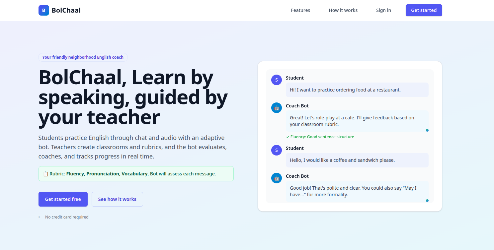
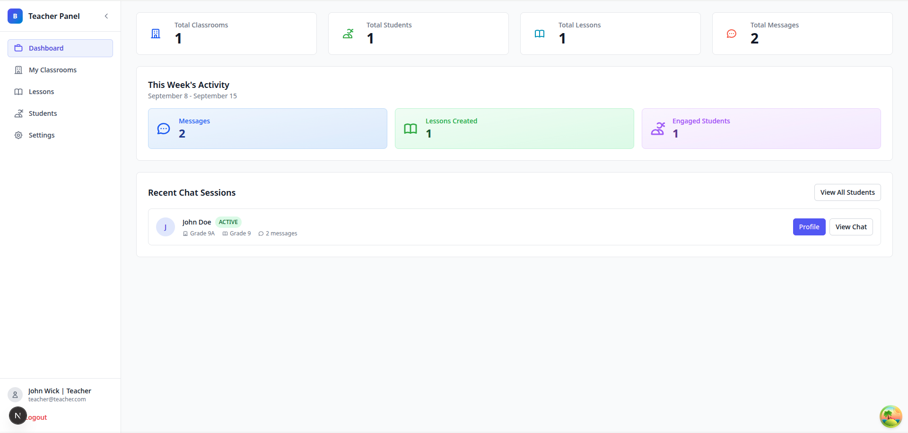
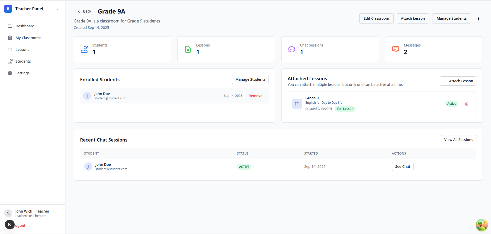
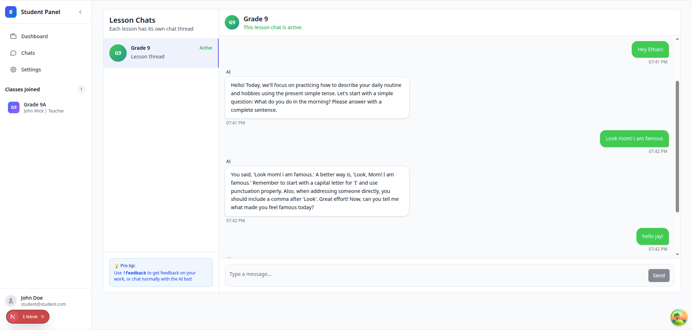

# Bolchaal

A platform where teachers create classrooms and rubrics, and students engage in chat or audio conversations with bots to practice, improve, and get feedback on English.


## Main Scalable AI generation Text/Audio Pipeline


## Application Images

Application Homepage



Teacher Dashboard




Classroom Management



Student Chatroom with Bot




## Tech Stack

- **Frontend**: Next.js 15, React 19, TypeScript, Tailwind CSS
- **Backend**: Node.js, tRPC, TypeScript
- **Database**: PostgreSQL with Prisma ORM, with WebSockets
- **Queue**: BullMQ with Redis
- **Auth**: JWT with Jose
- **Build**: Turbo (monorepo), pnpm
- **Deployment**: Docker, Docker Compose

## Setup

### Prerequisites
- Node.js >= 18
- pnpm 8.15.6
- Docker & Docker Compose

#### For PNPM
```
npm install --global corepack@latest
```
### Development
```bash
# Install dependencies
pnpm install

# Start Database
docker compose up -d postgres redis

# Setup Env Variables
find . -name ".env.example" -exec sh -c 'cp "$1" "${1%.example}"' _ {} \;

Use Vercel AI Interface to Generate Token for enabling ai features

# Setup database
pnpm run db:first-time-setup

# Start development servers
pnpm run dev
```

Services run on:
- Web: http://localhost:3000
- Backend: http://localhost:3005
- BullMQ: ws://localhost:3006

## Deployment

### Docker Compose
```bash
# Build all services
docker-compose -f docker-compose.build.yaml build

# Run in background
docker-compose up
```

### Environment Variables
# Setup Env Variables
```
find . -name ".env.example" -exec sh -c 'cp "$1" "${1%.example}"' _ {} \;
```

Required variables:
- `DATABASE_URL`
- `REDIS_URL`
- `JWT_SECRET`
- `AI_GATEWAY_API_KEY`

The main prompt templates for AI features are located in `packages/common-utils/prompt.ts`.  
These prompts are currently generated using Gemini and are still being improved.  
If you need to add or update a prompt, please edit or add a file in that directory. 📄